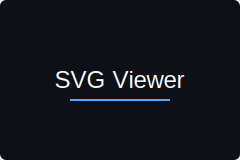

# Hello, I'm Zhang 👋

## Recommended Projects 💻

<table>
  <tr>
    <td>
      <h3 align="center">DeepBolt</h3>
      
      
<a href="https://deepbolt.xyz">DeepSeek R1 Code Generator</a>

    </td>
    <td>
      <h3 align="center">SVG Viewer</h3>
      

        
        
<a href="https://svgviewer.app">SVG Viewer</a>

      

    </td>
  </tr>
</table>

## GitHub Stats 📊

## Language Usage 📈

## Connect With Me 📱

## Visitor Count 👀

---

⭐️ From [Zhang](https://github.com/ZhangVampire)

